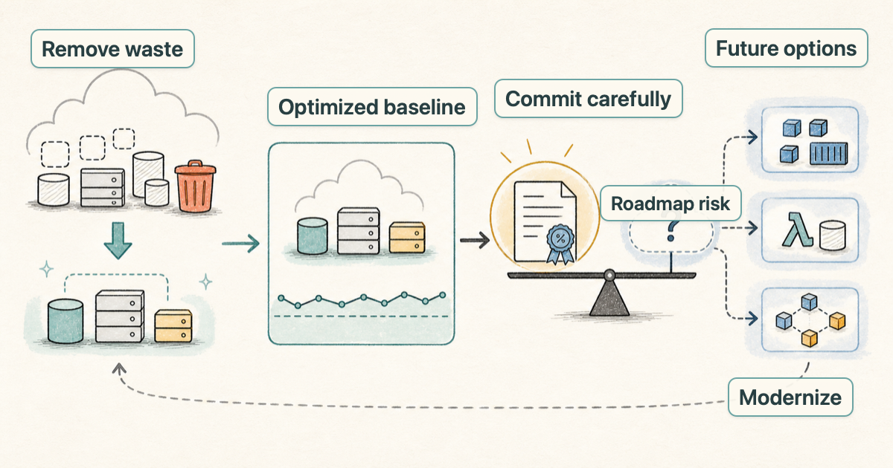

---
blog:
  publish: true
  slug: optimize-first-commit-carefully-a-better-aws-cost-strategy
  title: "Optimize First, Commit Carefully: A Better AWS Cost Strategy"
  description: Why the standard AWS cost optimization playbook is technically right, but still needs business and architecture context before buying long-term commitments.
  image: assets/optimize-first-commit-carefully-hero.png
  date: 2026-06-29
  tags:
    - aws
    - cost
    - finops
    - savings-plans
    - reserved-instances
---

# Optimize First, Commit Carefully: A Better AWS Cost Strategy

Most AWS cost optimization work follows a sensible order:

1. Remove waste.
2. Improve the efficiency of what remains.
3. Modernize where the architecture justifies it.
4. Use Savings Plans or Reserved Instances for the predictable baseline.

There is nothing wrong with this playbook. It is the order I would expect a strong engineering team to follow, because buying commitments before understanding the real baseline can hide waste instead of removing it. That is what makes the next question interesting:

> If this process is technically correct, how can it still lead to a poor financial decision?

## The Hidden Assumption

The weakness is not in the optimization work. It is in what we assume after the optimization work is done. Savings Plans and Reserved Instances are not just discounts; they are commitments. AWS gives you a better rate because you are giving AWS some confidence about your future usage.

So when a team buys a one-year or three-year Savings Plan, or reserves capacity through Reserved Instances, it is making two statements:

- This workload is predictable today.
- This baseline will still exist in a useful form during the commitment period.

The first statement is usually easy to prove with billing data. The second one requires engineering judgment because it depends on what may happen to the architecture, platform, and product roadmap during the commitment period.

A workload can look stable on a cost chart and still be a bad candidate for a long commitment. For example:

- the application may be scheduled for modernization
- the compute layer may move from virtual machines to containers or serverless
- a platform team may consolidate clusters
- a product may be retired
- a database may move to a managed service
- a batch job may be redesigned so it no longer needs the same always-on capacity

In all of those cases, the past bill was real, the current baseline was real, and the discount opportunity was real. The problem was that the assumption behind the commitment was weak.

## Growth Phase and Stable Usage Are Different

Growth changes the commitment profile. New services are launched, traffic increases, teams deploy more workloads, and existing systems need more capacity. In that environment, committing to a well-understood baseline can make sense because future usage may naturally absorb the commitment.

Stable usage can look safer because the AWS bill is predictable, the workload has been running for years, and AWS recommendations may show a large opportunity for Savings Plans or Reserved Instances. But a stable bill does not always mean a stable architecture. In a stable environment, the biggest savings opportunities often come from changing existing systems rather than adding new ones.

That changes the risk:

- In a growth phase, optimization competes with expansion.
- In a stable phase, optimization may remove or replace the very infrastructure that was committed.

That is the trap: stable usage feels commit-friendly. On paper, the decision looks straightforward because the usage is predictable, the discount is available, and the commitment reduces the bill. But the real risk is not whether the workload is stable today. The real risk is whether it will still exist in the same form throughout the commitment period.

## A Better Decision Framework

The better question is not whether the current AWS bill is stable or growing. The better question is how much infrastructure change we expect during the commitment period.

That changes the decision from a simple coverage target into a judgment call:

- Mature workloads, settled architecture, predictable roadmap: longer commitments can make sense.
- Growth through similar workload patterns: commitments can make sense because new usage may absorb the spend.
- Modernization, migrations, aggressive rightsizing, consolidation, or uncertain product direction: commit more conservatively.

A conservative strategy does not mean avoiding Savings Plans or Reserved Instances altogether. It may mean choosing a shorter term, committing only to the durable portion of usage, or leaving some predictable spend uncovered because the flexibility is worth more than the additional discount.

The important point is that the goal should not be maximum coverage. A high Savings Plan or Reserved Instance coverage percentage can look good in a dashboard while still being the wrong decision if it limits better optimization later.

## The Actual Goal

AWS cost optimization is not just about reducing this month's bill. It is about making decisions that still make sense after the architecture changes. The standard playbook is still useful: remove waste, improve efficiency, modernize where appropriate, and then commit to the predictable baseline. But before turning that baseline into a one-year or three-year commitment, the team should ask one more question:

> Will this baseline still exist in the same form for the length of the commitment?

If the answer is yes, commit confidently. If the answer is uncertain, preserve flexibility. The goal is not to maximize Savings Plan coverage; the goal is to maximize the amount of money the organization keeps over the full commitment period.
